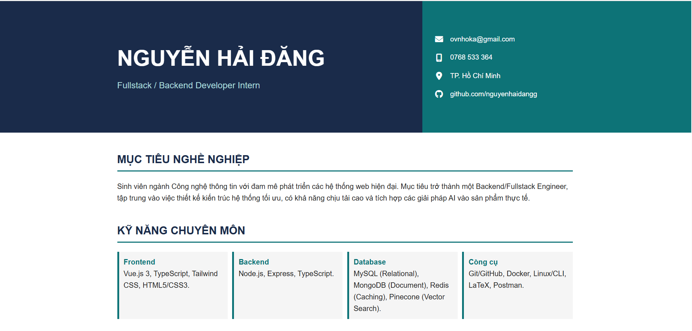
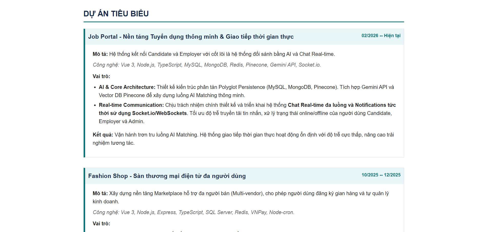
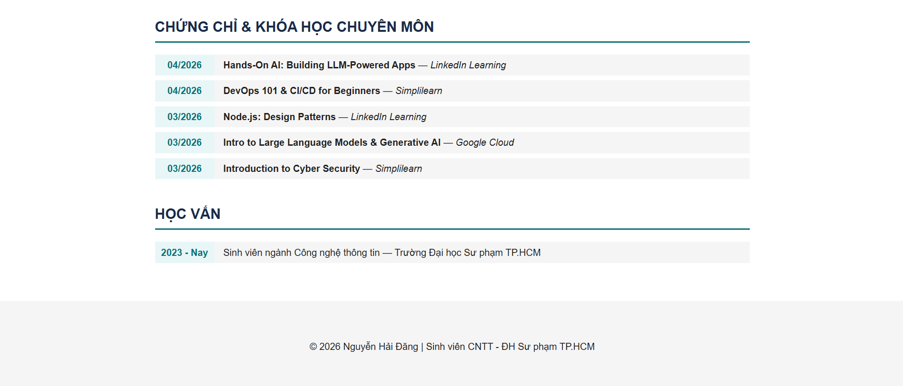

# 🌐 Portfolio Website - Nguyễn Hải Đăng

## 📌 Giới thiệu

Đây là website portfolio cá nhân được xây dựng nhằm giới thiệu thông tin bản thân, kỹ năng chuyên môn, các dự án tiêu biểu và chứng chỉ đạt được trong quá trình học tập.

Website được triển khai bằng GitHub Pages, hoạt động như một CV online giúp nhà tuyển dụng dễ dàng tiếp cận và đánh giá năng lực.

---

## 🚀 Công nghệ sử dụng

* HTML5, CSS3
* JavaScript
* Font Awesome (icons)
* Git & GitHub (quản lý source code)
* GitHub Pages (deploy website)

---

## 📂 Nội dung chính của website

### 👤 Giới thiệu

* Thông tin cá nhân
* Mục tiêu nghề nghiệp (Backend / Fullstack Developer)
* Định hướng phát triển (AI, hệ thống phân tán)

### 💼 Dự án tiêu biểu

* **Job Portal (AI Matching + Real-time Chat)**

  * Sử dụng Vue 3, Node.js, MongoDB, Redis, Pinecone
  * Tích hợp AI (Gemini API)
  * Xây dựng hệ thống chat realtime bằng Socket.io

* **Fashion Shop (Multi-vendor E-commerce)**

  * Phân quyền Buyer / Seller / Admin
  * Thanh toán VNPay
  * Redis cache + cron job

* **Fashion Shop (Distributed System)**

  * SQL Server Replication
  * Hybrid Database (SQL + MongoDB)
  * Xử lý dữ liệu theo vùng miền

---

### 🎓 Chứng chỉ

* AI & LLM Applications (LinkedIn Learning)
* DevOps & CI/CD
* Node.js Design Patterns
* Generative AI (Google Cloud)
* Cyber Security Basics

---

### 📞 Liên hệ

* Email: [ovnhoka@gmail.com](mailto:ovnhoka@gmail.com)
* Phone: 0768 533 364
* GitHub: https://github.com/nguyenhaidangg

---

## 🔗 Link website

👉 https://nguyenhaidangg.github.io/

---

## 📸 Hình ảnh minh họa

### Trang chủ


### Trang dự án


### Trang chứng chỉ


---

## 📦 Cách chạy project (local)

```bash
# Clone repo
git clone https://github.com/nguyenhaidangg/nguyenhaidangg.github.io.git

# Mở file index.html bằng trình duyệt
```

---

## 📝 Ghi chú

Website là static site được deploy trực tiếp bằng GitHub Pages, không sử dụng backend server.
